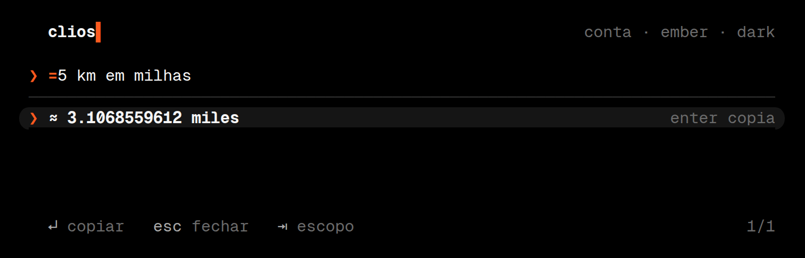
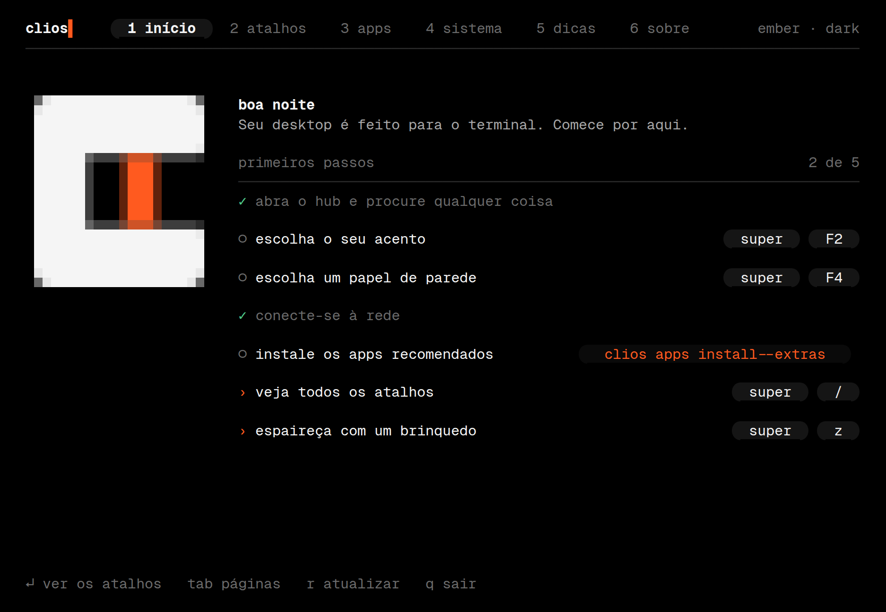
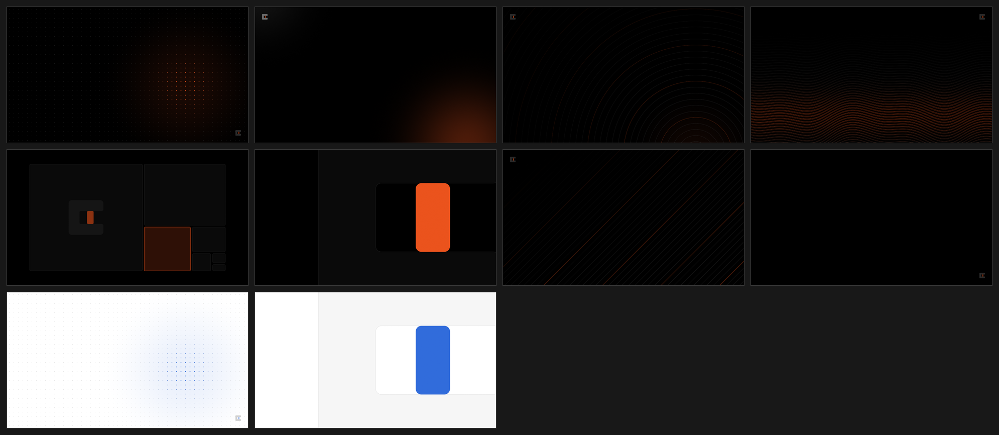

<p align="center">
  <picture>
    <source media="(prefers-color-scheme: dark)" srcset="brand/wordmark.svg">
    
  </picture>
</p>

Um desktop Linux feito para o terminal. Arch, Hyprland e Quickshell, com uma regra: o que dá para fazer num terminal é feito num terminal. O resto do sistema é mínimo o bastante para sumir.

Preto no branco e branco no preto, mais um acento que você escolhe. Uma fonte só. Movimento curto, que respeita quem não quer movimento.


## O que tem aqui

- **`clios`**, um binário em Rust, com os comandos do sistema: `theme`, `hub`, `open`, `sync`, `shot`, `status`, `motion`, `doctor`, e, desde a V0.2, `welcome`, `wallpaper`, `apps`, `update`, `fetch`, `caffeine`, `night`, `dnd`, `rec`, `pick`, `power` e `saver`, na V0.3, `prompt`, `greet`, `play`, `focus`, `ocr`, `notifs`, `keys` e `self-update`, e, na V0.4, `term`, `session`, `snap` e `battery`.
- **Tokens de design** (`tokens/tokens.toml`) que controlam cor, movimento e tipografia. Hyprland, Quickshell, foot, helix, fish, btop, yazi, lazygit, mpv e a tela de bloqueio leem os mesmos valores. Trocar o acento ou o modo muda tudo junto, e os terminais abertos mudam na hora.
- **O hub**, um lançador que roda dentro de um terminal (`SUPER + espaço`): apps, TUIs, ações, janelas abertas, atalhos e histórico da área de transferência numa busca só. Com `+`, ele mostra os apps curados que faltam e instala com Enter; com `=`, faz contas (`= 18% de 230`, `= 5 km em milhas`).
- **A sessão volta no login**: cada terminal reabre na pasta e na workspace onde estava, com o editor que estava aberto. Num desktop onde quase tudo é terminal, isso funciona de um jeito que um desktop gráfico não consegue.
- **Atualizar sem medo**: com a raiz em btrfs, cada atualização ganha uma fotografia antes e outra depois. `clios snap diff` mostra o que mudou e `clios snap undo` desfaz, com o sistema rodando.
- **Até o diálogo de arquivo é um terminal**: abrir e salvar no Firefox abre o yazi numa janela flutuante.
- **O guia de boas-vindas** (`clios welcome`, `SUPER + F10`): primeiros passos ao vivo, atalhos desenhados como teclas, o catálogo de apps, a central do sistema, dicas e o sobre. Abre sozinho no primeiro login.
- **44 apps de terminal** curados, em dez categorias, com descrição e dica de uso; os essenciais já vêm, o resto instala sob demanda. A regra é um app por trabalho, e um teste a faz valer.
- **Um terminal que se apresenta, mas só às vezes**: o resumo do sistema (fastfetch, com a marca) no primeiro terminal depois de ligar, duas linhas discretas na primeira vez que uma workspace vazia recebe um, e silêncio no resto do tempo. O prompt tem três estilos (`clios prompt`).
- **Brinquedos que entram no sistema**: cbonsai, aquário, tubulações, lava, sakura, chuva digital, relógio e mais. Revezam na proteção de tela, na cor mais perto do seu acento, e `SUPER + Z` abre um ao acaso.
- **Papel de parede que segue o tema**: oito estilos gerados em Rust com as cores do acento, mais as suas imagens (`SUPER + F4`).
- **Configuração do Hyprland em Lua**, com todos os atalhos documentados (`SUPER + /` lista todos), e **uma shell em Quickshell** (barra, OSD, notificações, papel de parede).
- **Instalação**: `scripts/bootstrap.sh` sobre um Arch mínimo, e um perfil de ISO ao vivo.








## Estado atual

Leia isto antes de instalar.

**Testado** (314 testes de Rust, mais os validadores abaixo, tudo rodando no CI):

- Os tokens e o contraste: todo acento e toda cor de texto passa de 4.5:1 nos dois modos, e o build quebra se isso piorar.
- Os templates de cada app renderizam em 48 combinações (modo × acento × nível de movimento), e JSON e TOML saem válidos.
- O config Lua do Hyprland roda num interpretador contra o stub oficial da API do Hyprland 0.56. Funções, nome e tipo de cada opção, folhas de animação, efeitos de regra e conflitos de atalho são conferidos. O próprio validador é testado com 18 configurações erradas que ele precisa reprovar.
- Os componentes visuais da shell renderizam fora do Quickshell (PySide6) sem nenhum aviso do QML, nos dois modos.
- O hub: busca, histórico, teclado, mouse, confirmação em dois passos e o desenho de cada quadro da animação.
- O guia, o seletor de papel de parede e a proteção de tela: renderizados em todos os tamanhos de terminal (inclusive minúsculos) sem pânico, navegação, cliques e configurações ao vivo.
- Os atalhos que o guia mostra (`config/clios/keys.toml`) são conferidos contra o Lua: citar uma tecla que não existe quebra o teste.
- Os papéis de parede: cada estilo, os dois modos, a escala por resolução, o recorte do contorno da marca, o PNG de ida e volta e a escolha de monitor.
- O leitor de notícias do Arch (feed de exemplo, datas RFC 2822, `.pacnew`) e os pequenos liga-desliga (pid, estado, argumentos).
- O catálogo: ids únicos, descrições completas, pacotes do bootstrap e dos extras separados, instalação com aspas.
- Os configs gerados valem para os programas de verdade: o `starship` aceita os três estilos de prompt, o `fastfetch` lê a config e o `nft` valida o firewall (o runner roda isso onde os programas estão instalados).
- A sessão: o que é capturado de cada janela, o que volta a rodar e o que não volta, e o comando que o Hyprland recebe. A ficha do terminal e o aviso de comando longo rodaram no fish de verdade.
- As fotografias: a lista e as mudanças no formato do snapper, os pares antes/depois, os pacotes que mudaram e a recusa quando a atualização trocou o kernel.
- O diálogo de arquivo: o campo de nome (atalhos do shell, acentos, extensão) e o fluxo de salvar num pty.
- Os scripts passam no `shellcheck`, e o `bootstrap.sh` tem `--dry-run`.

**Nunca rodou de verdade**:

- Nenhuma peça foi executada dentro de uma sessão do Hyprland, nem o Quickshell (os módulos que falam com PipeWire, UPower, notificações e Hyprland só foram conferidos contra o código-fonte do Quickshell e com `qmllint`).
- Os nomes dos pacotes do Arch foram conferidos por pesquisa, não por instalação. O bootstrap pula e avisa os que não existirem.
- A ISO não foi montada. O perfil e o `build.sh` partem do `releng` oficial, mas esperam ajustes na primeira execução.
- O snapper, o limine-snapper-sync e o portal de arquivos não rodaram de verdade: o formato da saída do snapper e os argumentos do portal foram conferidos no código-fonte de cada um.
- Nada foi testado em hardware.

Se você tentar e algo quebrar, o `clios doctor` diz o que falta, e uma issue com a saída dele ajuda muito.

## Instalação

Em um Arch já instalado (`archinstall`, perfil *minimal*). Escolha **btrfs** com os subvolumes padrão para ter as fotografias do sistema (`clios snap`), e o **limine** como carregador de boot se quiser que elas apareçam no menu de boot; com o `systemd-boot` e ext4 tudo funciona, só sem fotografias:

```sh
git clone https://github.com/kitsuneislife/clios
cd clios
./scripts/bootstrap.sh --dry-run     # veja o que vai acontecer
./scripts/bootstrap.sh               # instala pacotes, compila o clios, liga os dotfiles, ativa serviços
```

O script é idempotente. Seus arquivos de configuração que já existirem vão para `*.clios-bak` antes de serem substituídos. Para o console de texto (boot e TTY) usar a paleta do CLIOS, rode com `--kernel-cmdline`.

Para experimentar numa VM sem instalar, veja [`iso/`](iso/README.md).

## Uso

| | |
|---|---|
| `SUPER + espaço` | o hub |
| `SUPER + /` | todos os atalhos |
| `SUPER + F1` / `F2` / `F3` / `F4` | claro ou escuro / próximo acento / movimento / papel de parede |
| `SUPER + F9` / `F10` | central do sistema / guia de boas-vindas |
| `SUPER + C / N / D` | modo café / noturno / não perturbe |
| `SUPER + shift + R`, `SUPER + P`, `SUPER + shift + T`, `SUPER + U` | gravar a tela / conta-gotas / copiar texto da tela (OCR) / atualizar o sistema |
| `SUPER + X` / `SUPER + shift + N` / `SUPER + Z` | foco de 25 minutos / histórico de notificações / um brinquedo |
| `SUPER + h j k l` | foco; com `shift`, move a janela |
| `SUPER + 1…0` / `SUPER + shift + 1…0` | ir para a workspace / mandar a janela para ela |
| `SUPER + Q` | fechar a janela |
| `SUPER + ctrl + Enter` | terminal na mesma pasta do que está em foco |
| `SUPER + O` | o outro monitor; com `shift`, leva a janela; com `ctrl`, a workspace |
| `SUPER + E / G / A / I` | arquivos / git / áudio / rede |
| `Print` ou `SUPER + shift + S` | captura de região (salva, copia e avisa) |

A lista completa, gerada do próprio config, está em [`docs/KEYS.md`](docs/KEYS.md).

```sh
clios theme set --mode light --accent azure
clios theme set --accent "#7CFF00"        # qualquer cor; é ajustada para ter contraste
clios motion reduced                      # só fades curtos
clios doctor                              # o que falta no sistema
clios wallpaper                           # escolher o papel de parede, com prévia
clios apps list --missing                 # os apps curados que ainda não estão instalados
clios apps install --extras               # instala todos os recomendados
clios update                              # lê as notícias do Arch e atualiza
clios fetch                               # o resumo do sistema, com a marca
clios prompt dev                          # prompt de duas linhas (minimal, dev, zen)
clios greet --mode boot                   # o terminal só se apresenta ao ligar
clios play                                # um brinquedo ao acaso, na cor do seu acento
clios saver set bonsai                    # a proteção de tela (auto, marca, off ou um brinquedo)
clios focus 50                            # 50 minutos em silêncio, com contagem na barra
clios ocr                                 # copia o texto de uma região da tela
clios keys captura                        # os atalhos, no terminal
clios self-update                         # atualiza o próprio CLIOS
clios session                             # o que volta no próximo login (off: mesa limpa)
clios snap                                # as fotografias do sistema; diff N e undo N
clios night auto 20:30-06:45              # modo noturno todo dia, sozinho
clios battery limit 80                    # a carga para em 80%, também depois de reiniciar
```

Para mudar o catálogo do hub (as TUIs que aparecem), copie `config/clios/hub.toml` para `~/.config/clios/hub.toml`. Monitores e teclado ficam em `~/.config/hypr/user.lua` (há um `user.lua.example`).

## Como as peças se ligam

```
tokens/tokens.toml ──► clios theme apply ──┬─► ~/.config/hypr/theme.lua       (Hyprland: cores, curvas, molas)
   cor · movimento                         ├─► ~/.local/state/clios/theme.json (Quickshell lê ao vivo)
   tipografia · grade                      ├─► foot, helix, fish, btop, yazi, lazygit, mpv, hyprlock
                                           └─► OSC nos terminais abertos       (mudam sem reiniciar)

config/hypr/conf/binds.lua ──► hyprctl binds ──► hub (`?`) e docs/KEYS.md
config/clios/hub.toml ──────► hub, `clios apps`, o guia  e  `clios open <id>`  ◄── atalhos do Hyprland
config/clios/keys.toml ─────► o guia (conferido contra o Lua nos testes)
wallpaper (clios-core) ─────► ~/.local/state/clios/wallpaper.json ──► Quickshell cruza o fade; hyprlock usa o mesmo fundo
```

Dois detalhes que mudam o dia a dia: os atalhos de TUI chamam `clios open <id>`, então o catálogo do hub é a única fonte dos comandos; e a documentação de atalhos sai do próprio Lua, então não envelhece.

## Estrutura

```
tokens/        a fonte única de design
templates/     um template (minijinja) por app, e o manifesto que os liga
config/        dotfiles estáticos, ligados por symlink em ~/.config
seed/          arquivos que o app reescreve (btop): copiados uma vez
system/        arquivos de /etc (greetd, iwd, zram, sysctl, nftables, a política do Firefox)
crates/        clios-core (tokens, tema, sync) e clios (a CLI e o hub)
brand/         marca e wordmark em SVG, e o script que os gera
site/          a página do projeto (GitHub Pages), gerada do catálogo, dos atalhos e do changelog
iso/           perfil da ISO ao vivo
scripts/       bootstrap.sh
tests/         validadores de Hyprland (Lua) e de Quickshell (QML), e o runner
docs/          STACK.md, DESIGN.md, KEYS.md
```

## Desenvolvimento

```sh
pip install -r tests/requirements.txt
./tests/run.sh
```

O runner executa `rustfmt`, `clippy`, os testes de Rust, os validadores de Lua e de QML, `shellcheck` e a sintaxe do fish. Etapas cujas ferramentas faltam são puladas com aviso. As imagens da documentação saem de `tests/tools/shots.sh`, que usa os `--snapshot` do próprio binário e o harness de QML.

## Documentação

- [`docs/STACK.md`](docs/STACK.md): cada escolha, o que ficou de fora e o que a escolha custa.
- [`docs/DESIGN.md`](docs/DESIGN.md): a identidade: marca, cor, tipografia, forma e movimento.
- [`docs/KEYS.md`](docs/KEYS.md): atalhos.
- [`CHANGELOG.md`](CHANGELOG.md): o que mudou em cada versão.
- [`site/`](site/): a página do projeto, publicada no GitHub Pages.
- [`docs/identidade.html`](docs/identidade.html): a identidade ao vivo. Abra no navegador, troque modo, acento e movimento, e use o hub dentro do desktop ilustrado.

## Roteiro

- Um login em Rust (`greetd` + ratatui) com a marca e a animação do resto, no lugar do tuigreet.
- Um instalador, para não depender do `archinstall`.
- Papel de parede animado (o cursor da marca já pisca na proteção de tela; falta o fundo).
- Tema para o Firefox (`userChrome.css` gerado dos tokens).
- Fotografias também da pasta pessoal, com o mesmo `diff` e `undo`.
- A sessão lembrar o tamanho das janelas flutuantes e a ordem das colunas.

## Licença

MIT. A Geist Mono é distribuída pela Vercel sob a OFL; o stub da API Lua em `tests/hypr/` é do Hyprland (BSD-3-Clause).
