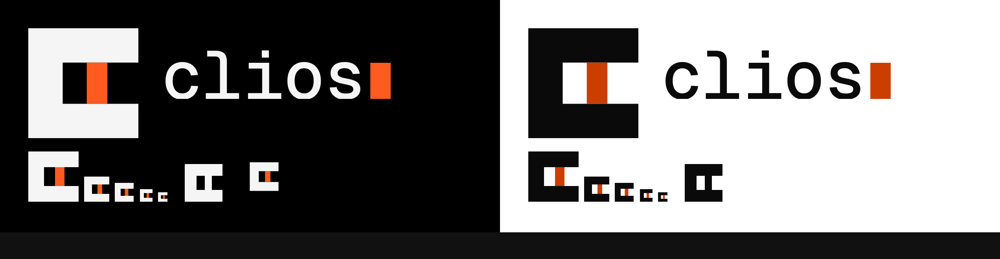
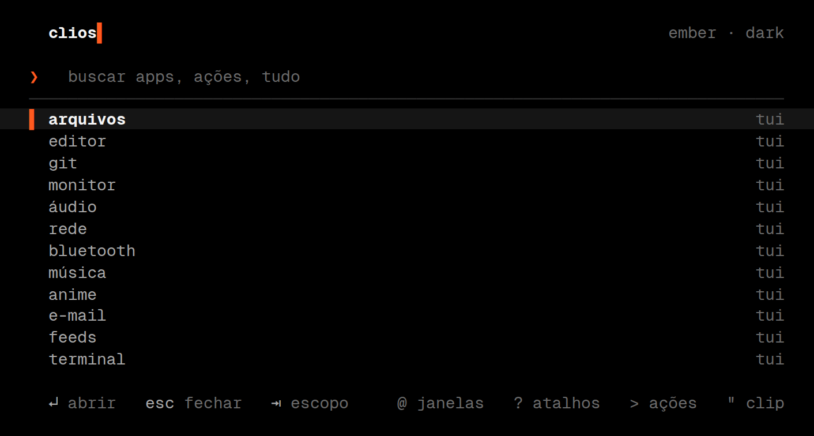
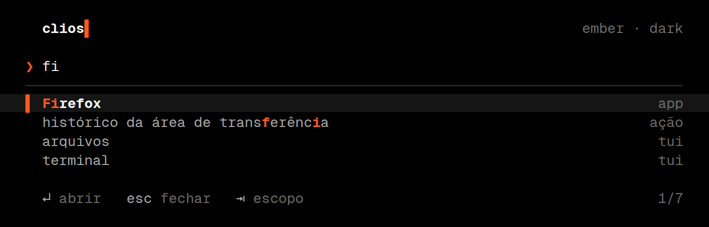
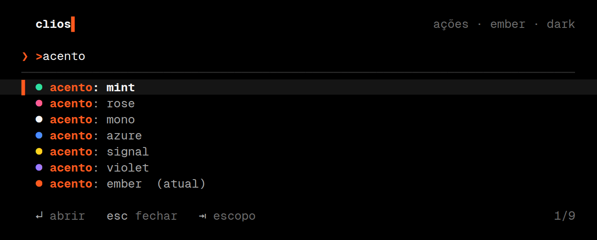
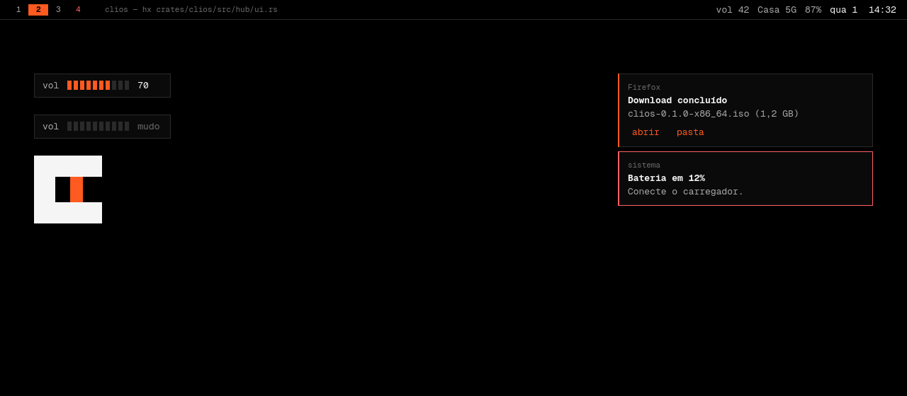
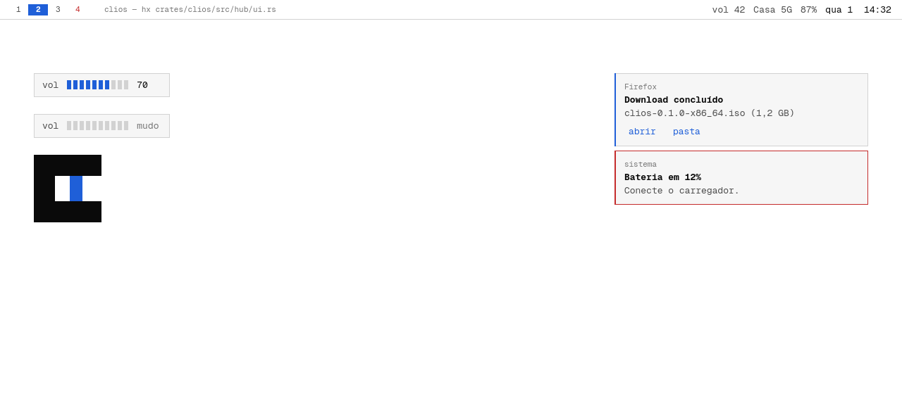

# Design

O CLIOS tem uma identidade só, e ela cabe em quatro decisões: preto e branco, um acento que você escolhe, uma fonte mono, e movimento curto. Tudo o mais deriva disso.

Todos os valores deste documento vêm de [`tokens/tokens.toml`](../tokens/tokens.toml). Os apps não guardam cor, duração nem curva própria: `clios theme apply` lê o arquivo e escreve a configuração de cada um.

## A marca

Um quadrado com a boca aberta para a direita, que forma um "c", e um bloco dentro dela: o cursor de terminal esperando uma tecla. O wordmark repete a ideia, com um bloco depois do `s`.

- Traço uniforme de 20 em uma grade de 64; cursor de 12 por 24, centrado na vertical.
- Corpo em branco (ou preto, no claro) e cursor no acento escolhido. Na versão de uma cor, o cursor usa a mesma cor do corpo e continua legível, porque há folga entre os dois.
- Foram testadas cinco proporções. A atual foi a que mais resistiu a 12 px; as que tinham o traço de 36 viravam um borrão.
- Arquivos em [`brand/`](../brand). `brand/build.py` regenera tudo; o wordmark usa contornos reais da Geist Mono, então o SVG não depende da fonte instalada.

No sistema, a marca aparece no canto do papel de parede (com o cursor piscando devagar), no cabeçalho do hub, e na tela de bloqueio.

## Cor

Dois modos, um acento. Os neutros são os mesmos nos dois modos, espelhados.

| token | escuro | claro | uso |
|---|---|---|---|
| `bg` | `#000000` | `#FFFFFF` | fundo de tudo |
| `surface` | `#0A0A0A` | `#F6F6F6` | notificação, OSD |
| `raised` | `#151515` | `#ECECEC` | linha selecionada |
| `line` | `#2A2A2A` | `#D2D2D2` | bordas e réguas de 1 px |
| `mute` | `#6B6B6B` (3.9:1) | `#767676` (4.5:1) | dicas, comentários |
| `dim` | `#A8A8A8` (8.8:1) | `#4D4D4D` (8.5:1) | texto secundário |
| `fg` | `#F5F5F5` (19.3:1) | `#0A0A0A` (19.8:1) | texto |

As razões de contraste são contra `bg`. `surface`, `raised` e `line` ficam de propósito quase invisíveis: a hierarquia vem de linhas e de peso de fonte, sem sombras nem gradientes.

### Acentos

Sete, cada um com uma variante por modo. Todos passam de 4.5:1 contra o fundo, o que permite usá-los como texto (o prompt, palavras-chave no helix) e não só como enfeite.

| nome | escuro | claro |
|---|---|---|
| `ember` (padrão) | `#FF5A1F` · 6.7:1 | `#CC3E00` · 4.9:1 |
| `azure` | `#4C8DFF` · 6.6:1 | `#1F5FD8` · 5.7:1 |
| `violet` | `#A07BFF` · 6.8:1 | `#6B3FE0` · 6.2:1 |
| `rose` | `#FF5C93` · 7.2:1 | `#D01F68` · 5.1:1 |
| `mint` | `#2FE0A0` · 12.3:1 | `#007A52` · 5.4:1 |
| `signal` | `#FFD21F` · 14.5:1 | `#8A6A00` · 5.1:1 |
| `mono` | `#F5F5F5` · 19.3:1 | `#0A0A0A` · 19.8:1 |

`clios theme set --accent "#7CFF00"` aceita qualquer hex. Se ele não atingir 4.5:1 no modo atual, o clios o escurece (ou clareia) mantendo o matiz até passar.

Derivados do acento, calculados no código: `accent_dim` (55% sobre o fundo, para estados inativos), `accent_soft` (18%, para seleção) e `on_accent`, o texto sobre o acento, que é o neutro de maior contraste.

As cores funcionais (`red`, `green`, `yellow`, `blue`, `magenta`, `cyan`) existem para diffs, erros e para as 16 cores do terminal. Não mudam com o acento e ficam fora da identidade: nada na shell usa verde ou azul decorativo.

Os testes de [`clios-core`](../crates/clios-core/src/theme.rs) quebram o build se qualquer acento ou cor de texto cair abaixo desses limites.

## Tipografia

Uma família só, em tudo: **Geist Mono** (OFL, pacote `otf-geist-mono-nerd`). Terminal, barra, notificações, hub, tela de bloqueio e OSD usam a mesma fonte, nos tamanhos 13 e 11. Peso e tom de cinza fazem a hierarquia; não há ícones.

Texto da interface em minúsculas e em português: `arquivos`, `rede`, `captura: região`. Os nomes dos programas ficam como são.

## Forma

- Cantos retos (`radius = 0`). O terminal é uma grade e a interface segue a grade.
- Borda de 2 px na janela ativa (acento) e na inativa (`line`). Sem sombra, sem blur.
- Espaçamentos: 6 px entre janelas, 12 px nas bordas da tela, barra de 28 px.
- Notificação: faixa de 2 px no acento à esquerda, ou borda vermelha inteira se urgente.

## Movimento

Poucas regras, aplicadas em todo lugar. As durações e curvas estão nos tokens, e Hyprland, Quickshell e o hub leem os mesmos valores.

1. **Entrada rápida, saída mais rápida ainda.** A saída dura cerca de 60% da entrada.
2. **Uma família de curvas.** Quem chega desacelera (`out`); quem troca de lugar suaviza (`inout`).
3. **Mola só para o que ocupa espaço**: janelas e workspaces, com amortecimento crítico. Nada quica.
4. **Movimento que respeita quem não quer movimento.** `clios motion` alterna entre completo, reduzido (só fades curtos, nada desliza nem escala) e desligado.

| duração | ms | uso |
|---|---|---|
| `instant` | 90 | troca de seleção, blocos do OSD |
| `fast` | 160 | fades, cor de borda, cursor das workspaces |
| `base` | 240 | janelas, notificações, OSD |
| `slow` | 360 | troca de tema no papel de parede |

| curva | pontos | uso |
|---|---|---|
| `out` | 0.16, 1, 0.30, 1 | chegadas |
| `in` | 0.70, 0, 0.84, 0 | saídas |
| `inout` | 0.65, 0, 0.35, 1 | trocas |
| `settle` (mola) | rigidez 320, razão 1.0 | janelas e workspaces |

Onde isso aparece:

- **Cursor das workspaces.** O bloco de acento sob o número ativo desliza até a nova posição em `fast`.
- **Hub.** As linhas entram escalonadas (14 ms entre uma e outra) na abertura e a seleção troca em `instant`, com um crossfade entre a linha que sai e a que entra. O cursor pisca a cada 530 ms, mas fica sólido enquanto você digita.
- **Troca de tema.** Cores da shell animam até o valor novo; terminais abertos mudam na hora, sem reiniciar.
- **Hyprland.** Janelas entram com `popin` a 92% e mola; workspaces deslizam 8% com fade. As camadas da shell ficam sem animação do compositor, porque o Quickshell já anima por dentro.

## Componentes

O **hub** é um terminal. `SUPER + espaço` abre uma janela flutuante do foot com um programa em Rust dentro: busca difusa sobre apps, TUIs, ações, janelas abertas, atalhos e o histórico da área de transferência. O primeiro caractere escolhe o escopo (`@` janelas, `?` atalhos, `>` ações, `"` clipboard). Ações perigosas (desligar, reiniciar, sair) pedem um segundo Enter em três segundos.

 

A **shell** (Quickshell) desenha a barra, o OSD de volume e brilho, as notificações e o papel de parede. Os componentes visuais ficam separados dos que dependem de serviços do sistema, e por isso dá para renderizá-los fora do Quickshell, como nas imagens abaixo.

A barra mostra só texto: workspaces ocupadas, título da janela, volume, rede, bateria, relógio. Cada trecho é clicável e abre a TUI correspondente numa janela flutuante.

## Regras para mudar

- Cor nova entra em `tokens.toml` e passa pelos testes de contraste.
- Nenhum app guarda valor próprio: se um programa precisa de cor, ele ganha um template em `templates/`.
- Sem ícones, sem sombras, sem gradientes, sem cantos arredondados.
- Texto da interface em português, minúsculo, direto ("captura: região", não "Tirar uma captura de tela").
